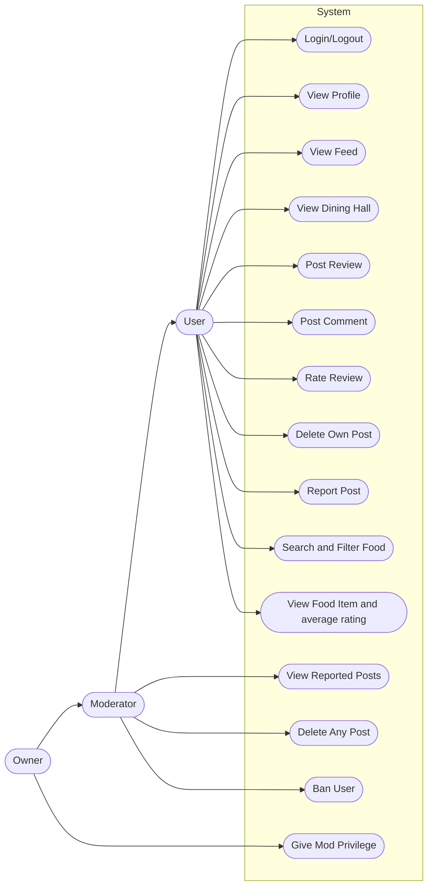
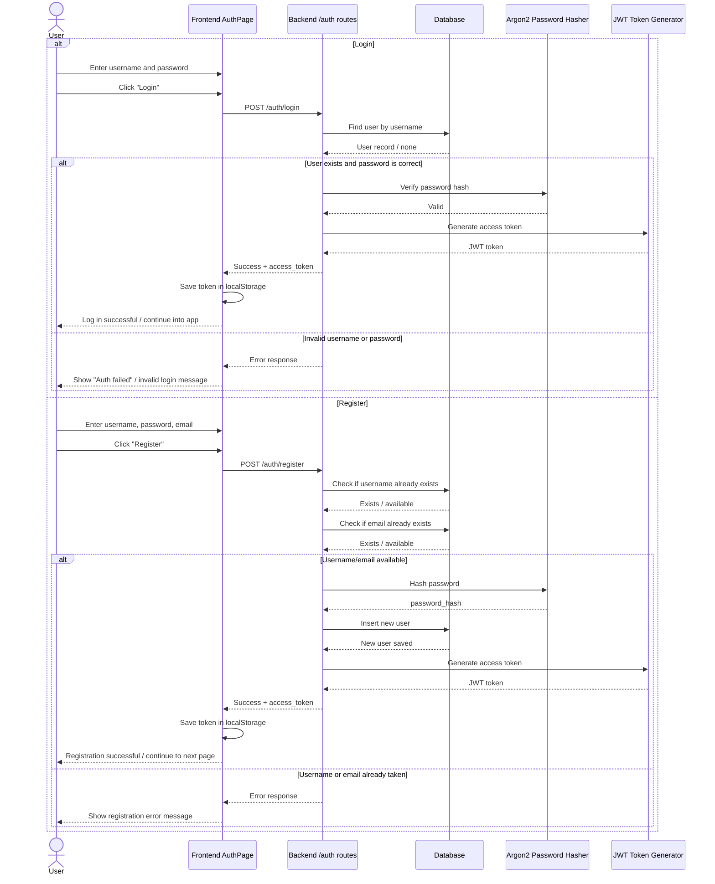
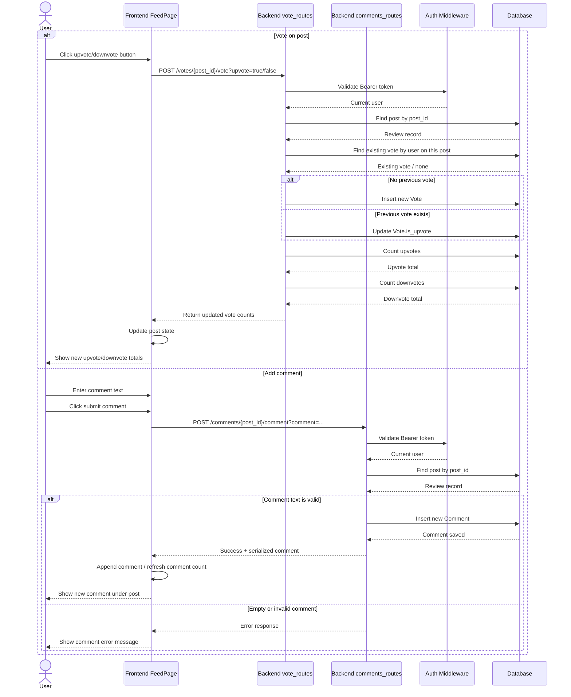
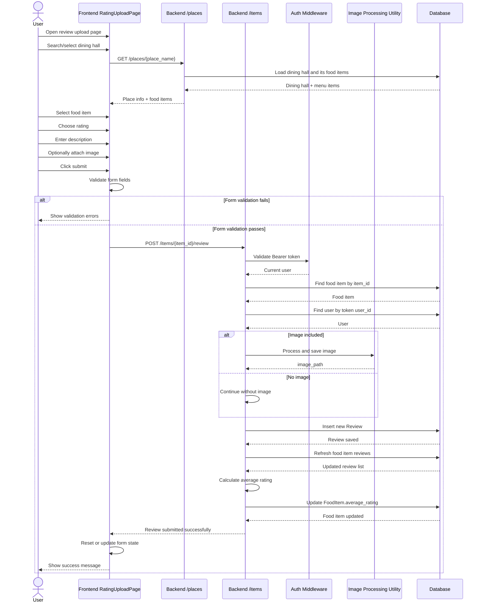
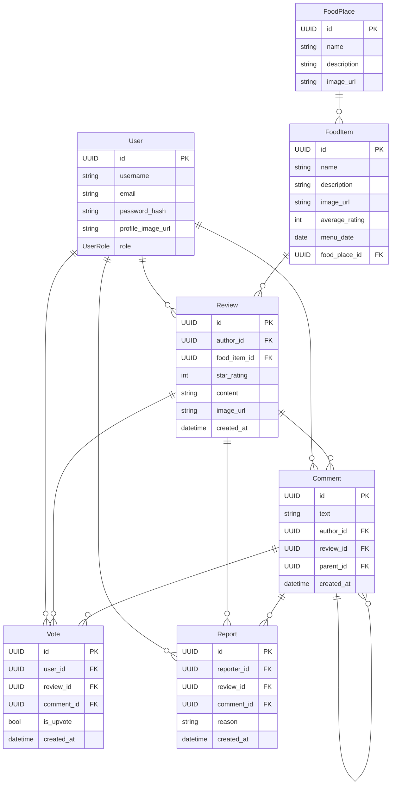

# Diagrams

## Usecase Diagram

[Also view on mermaid.live](https://mermaid.live/edit#pako:eNplVGGP2jAM_StRpJM6iWNQytH2w6TtGNskTjuBtg8rU5WjplRrkyptuWOI_z4naVkDEip59rPj2E8-0a1IgIY0lazck-VqwwkRrxykE31Xf7_fKUshEid6QqZktWhtTaVIP6qOs-HqWzUvJtX6WNVQGCMhuUgzHuNXNLUTLRV6v9TIBBNyyOA1LqXYZTk40U9E5Nkgi7EDSFr3Ao-WL8l4xtN4z_K8pcy1hXxFS8csRVXHElSAEz0jICsNLP9WFAXwuiU8GtQxsAdwybBCcJUhgRyQoRI50VwDgr0kKtclB5RC1i1npYHlr4DJ7T7eCdX4tQaE8YQssrwGSRZot56ONeFDu8agl3zD7usQdsCppUAMRUWZuLs7ghPt59BlQKKrqtpcq9aoq6uunsj40X7mR360nvHCeGx08olx0mnlcr9WmEFpdoBYy-wLnlRlOP7sgONPoYsBnpiDSknu7z9YsrIcfTWRW49S0a21px_L2ZOMZe8J4ZbfSshy9JRhJ_qvBsveU8FttWaepiHYuJ7DmmPf3Y2jb7sapcmnN4B2d3O5thempC6LykoHtABZsCzBfXLSK4HWeyhgQ0M8Jkz-2dANPyOPNbVYH_mWhrVsYEClaNI9DXcsrxA1ZYKdnWcMN0nRUUrGfwlxgalU17TRKAyQj6LhNQ0DTaXhib7R0HVHw9nIc4MgcB9m05k_oEcajsfu0Pf8ycibef50Mh0_nAf0r04-HnqTqeuN_cCf-fgLvK6cz0mGq6-7EjR6MrtTr9DzP5NRyBY)
## Sequence Diagram 1: Login and Register

[Also view on mermaid.live](https://mermaid.live/edit#pako:eNrlVttO20AQ_ZXRvtaQmNzAD0iEQEvVS9QAlapIaLEnyQpnN91dAyni3zvrS5KtE0DtY_OS2D5n5szlbPzEYpUgi5jBnxnKGAeCTzWfjyXQh8dWabgyqIvrBddWxGLBpYWTzM6GfIrADZxrJS3KZHVzO_xkeOHQfR7fOXCD0z3QKrNo6oRB32EH3PJbbrYEHHJjHpROPnAzQ-2wJ3qq5MHqARRP6syP3y8d3H1dKlIC71Gi5lTqWJZ1pxY-qakoL93HNWHv-LgqMIIzqlhDRrcln1MXqKBFmfkF1mkq4jsYsyI6WyMrSImmVkUw_Dq6LLrUSH01JYTAg34E54KSOyVwu1wpWoMH_b3NqE4TaIxdixoglcTxRmRXeo7AR2Gs8eoCYYBoxLVrgi_Hn0oE16jFZLmOMKP7PtdneEqveSqSXZlofFE1OWp_HKMxYN08fQbhvKBu7FtgVWBvWqOsCPuujH-zg7gxuJLI77HIAkJCqmKejmi_Vs6okYntuh65tXMUU2SeZCnNKCZ3CZkhPbAK-GKxDoKpQbiQ965T62Uk09Z3cWeVZ1ortxFmoaR5VeBoph5ogd0DmHCRYjJmpFGUGvJFhTlp94olv1dblkv-hlNar8qdbzBYsKooAJxT3jeYbJXk7T7TNV2-1U5nSKHFZMP4qUaeLEu_7HTdWWGnBvB7Es9vU3w1RV7mv8Svu9opbpRx6zpetrL73rFWL3i4ItzUne-XfUG7py1IfMh760P_KPZLCQJDPvvfTohiq6kmoXadE3RKSHy01HzPg854VxtnhL9glr-t5L84LvSmZMz520-I8gcL2FSLhEVWZxiwOWpSSpfsyUHGzM6Q_uBYRD8TnPAstc7iz0SjP_gfSs0rJr1cTGcsmnAqPWDZIqFNKN9wVhDKh_pUZdKyKOzmIVj0xB5Z1Ovt9w677bDbax8ddTqdw4AtCXPU3e-FvXaz1Wu3O4dh2HoO2K88abjfarYOmp1m2DrodcJ2txMwTATN9XPxlpW_bD3_Bokv7_Q)
## Sequence Diagram 2: Vote and Comment on a Post

[Also view on mermaid.live](https://mermaid.live/edit#pako:eNqVVttO4zAQ_RXLr1vahrYEIgGiLUg8sFvBwsOqEnKTobVo7KztAAXx7zt27m3D7uYliTNz5szl2PmgoYyABlTD7xRECFPOlorFc0HwYqGRitxrUNl7wpThIU-YMOQKIJqxJRCmyZWSwoCIysVd8wdp4GJ2ba3HLHy2xi-49KhkakDv2k9kHIMwWy5htqpb3S5Ss7IO7n7Do2gNr0zt4TMdW7MpM2zBNH7PE15nTIkUJJHaZKv2skU4ODsrEgzIZM3DZ5ImNoteJF-FfSCL1BgpKrfCHl3zCgRk9uPuJ-lZc937sFEeefTp3s8zuFOjUug9sbWGCil3RyCbW0Ae2JpHDEOOARNUxEisUGVujQ7qUSepUlg6kpbdbKJOxwG54lhjy4gsNiRnVtlOxw3AW3jh8EoUhFJFXyLCG9eGiyXJSrRxHGyJzYrrrTpvBblsuPaIkKJsVtGw75IkCsnIVDuz6usun2uBoQ0RSPyhYQpYbDKrw2S09Vdo94nrgF3scv2Yda-GKaI616bvRKa2G85Ft-Z_775jcw1bf41UjGA71rQY0ha0xnjfgkmVQH42w0yrqD4MpPcOd-WY18RNkTasXo_SHh2sngJyt5KvrhnbOnIU81CuNRdRqf4vRHmJ25Aq7IiBt78rWKeLmJtd7Fpy1V5UiLfYh2r6zZfO8_tpt9utwCqE_9VvPfZ-CTew_1XFddgtITfFNanVkqBaXyztpiZ2CNRENtku634KRRTNXqAdvdG9uzQMQWvyjWAwjqzeYc-EtI7pRZLUDhTcWRQ8KdCrcsUNewvQ7vwWXqmIsJfNLc3N72WcmA3B05QLV8L9VNuSvVQKXZFfIoWGf2JVMALnGmOpynO53JvyB9qhS8UjGthzp0NjUDGzr_TDmsypWUEMcxrgYwRPLF2bOZ2LT3TDo_SXlHHhiafyckUDd3J1aLZ35D8U5SpOMJbI7Vk08AYOgwYf9I0Gvt_1j4-G3pE_PDkZjUbHHbpBm5Ojru_5w_7AHw5Hx543-OzQdxfV6w76g8P-qO8NDv2RNzwadShEHH9abrK_Gvdz8_kHe5nMsg)
## Sequence Diagram 3: Submit a Food Review

[Also view on mermaid.live](https://mermaid.live/edit#pako:eNqNVslu2zAQ_RWC1zpxXNtxokOAOm6KAF2CpOmhMBAw4tgiSpEql6Sp4X_vkJIlWV5QXySR783yZjjmiqaaA02ohd8eVAozwZaG5XNF8MdSpw15tGDK74IZJ1JRMOXIYyE143dsCYRZcmO0cqA4uWdOqGWzuUu8kywF--HuNvCmLP0VaP0iru6ibx3kO2ARFnexH7zLAi4-vwjOJbwysyeE2xwjuzMaPVpMEClxhVRLmAB5dEIK97bLnU0DfsYce2YWbZeIoNHJ1VWTd0K-FaCIgRcBr8THdbSzEWQP_gGYSbO-BQmpI1yoEEbGpKwYNRR5tYYJ-fTx-0a9_io-nxTLYV2yaiCSZtOEfA5htGwThnoKZ8lC6_BS6zqbnmz7mbVI70gOyrfhjZ9OVnGDCLXQyGo7OaJDFKDGHgReZ1pbICZ23EHUR-xLQzjY1IjCCX2sYGEb83sjzDmWZkTkxwp2LUX6i1j_nAtX59OuUhv8g0nBmQPMy-RkIUDyWgQmHbkJyy8lCKMgCyZkpW3HbjCMwaBQmX5tU8AYbSoOSFSma7Ng1sJ-o1dXm4OGJfv28L06Y_1VeDwJvu6XndyQN3ikhvPWynCKjYySO42HtcEH0MmWn2tvDOCJ8vV86dgNDXsjsEHrXiDPb6SKqGGUrdrYvdnunENGg9tgL8YZv45aLadgsx-KVk4NoVLpObS4HZfb4ybZjJl49ix7gXaf1fQtznYoEf5UMJc1nFjwr3qvqVYkjfg4r4XyQF6Fy7R3XSLO2Xa2HQFvFarhiMLRdt_pi65u5X7Mkx-0dw8LAzZrFbpsN3ukHkVoNr6ZsFJYt9d8K2UmUy9Dh2IsJlSuPTr2RFW6iP0Udk4r2lOXdrABce7HIPcq2RkQG53iOAmJWZ-G4i88DqQDZ3abb8ER_DcrfZZzxjp8_Y8pUvnCsW5t3QbYArRHl0ZwmjjjoUdzMDkLn3QVIHPqMshhThN85bBgXro5nas10vC_8qfW-YZptF9mNFkwbNMeLUOsrhr1Kg4DDuZae-VoMhhGGzRZ0T80mUxOJxfno8H5ZHR5OR6PL3r0DTGX56eTwWR0NpyMRuOLwWC47tG_0evgdHg2fH82PhsM30_Gg9H5uEeBC7zOfCnvO_Has_4HIjnoVQ)

## Database Class Diagram

