# Documentation for IC Eats

For installation instructions please refer to [INSTALL.md](INSTALL.md).

Accessing the website from the browser at https://ic-eats.untitledham.com
Or alternatively, if you have the project running locally, access it at http://localhost:5173.

Upon accessing the page you will be greeted with a login/register page.

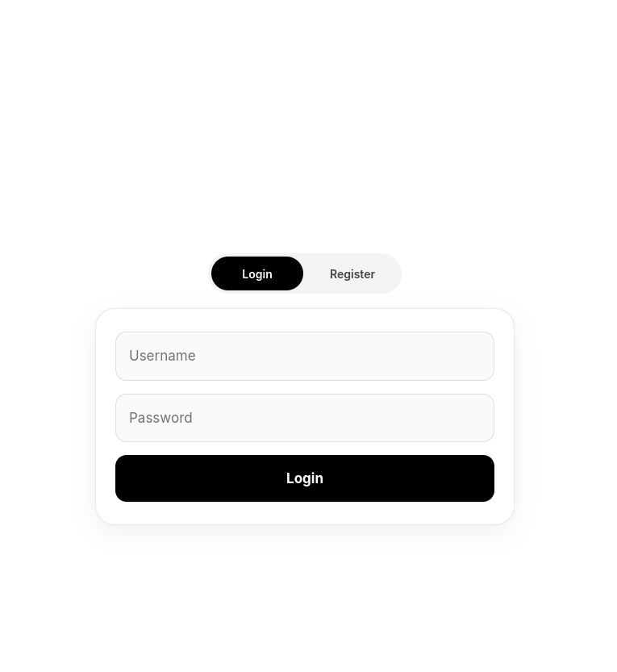

# User Guide

You can register a new account by clicking on register and filling out the form.
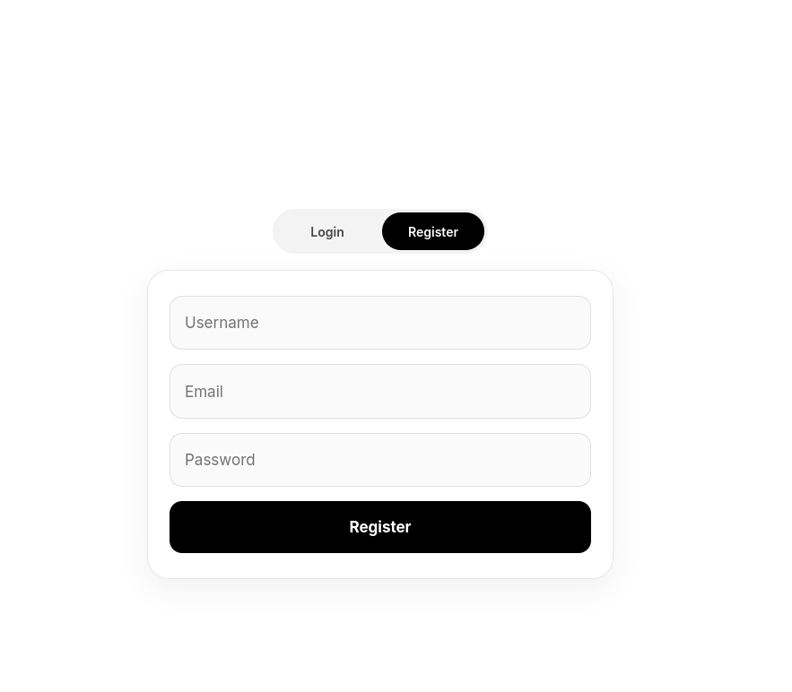
Please use a valid email address and a strong password when registering.

Feel free to upload a profile picture here (but it's not required):
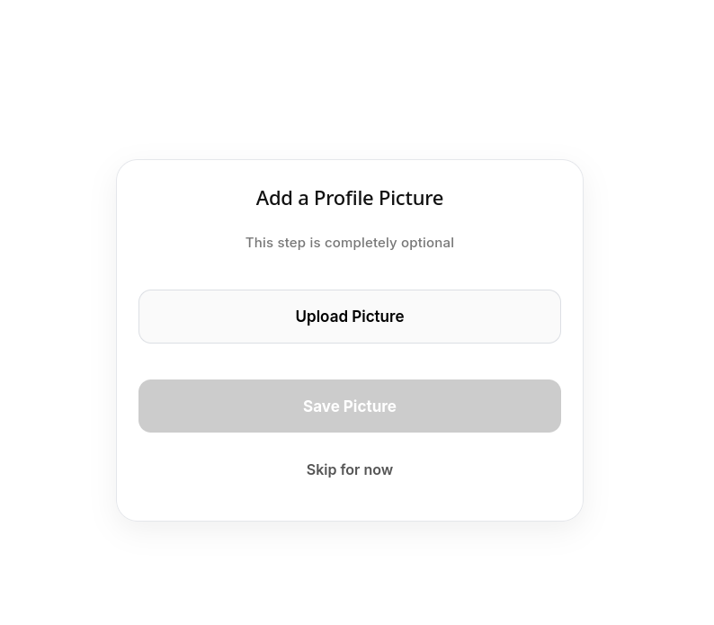

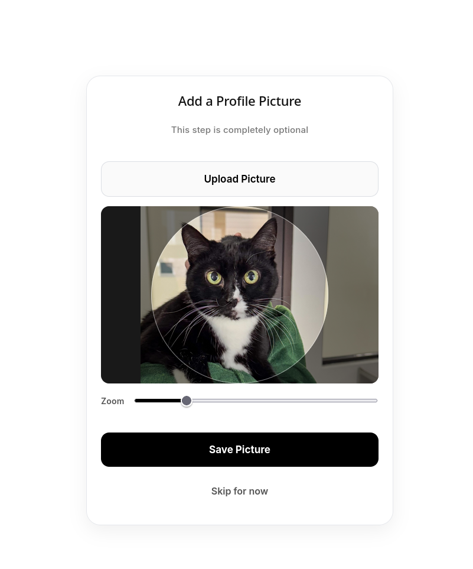

Hit either "skip for now" or upload a picture and click "Save Picture" to continue to the main page.

You will now be met with the main page where you can see a feed of reviews from other users.
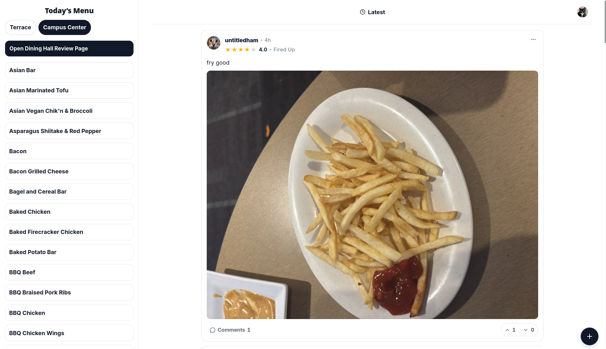

Lets leave a review, click on the plus button in the bottom right to open the review form (or click on the respective item on the side bar)

Choose what dining hall you want to review an item from
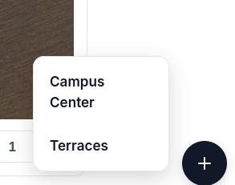 

Use the search bar to find the item you want to review, then click on it to select it.

Now leave a star rating and a comment about the item. Also optionally upload a picture of the item you reviewed.
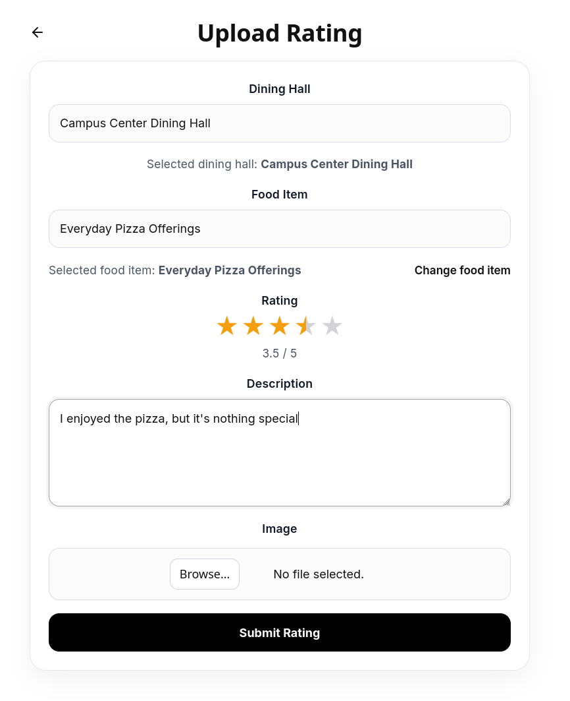

Now hit "Submit Rating" and your review will be posted to the feed for everyone to see!
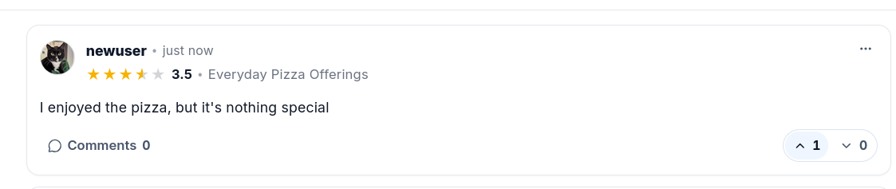

Now lets look at some other reviews

Find a review and upvote it or downvote it by clicking on the respective buttons.
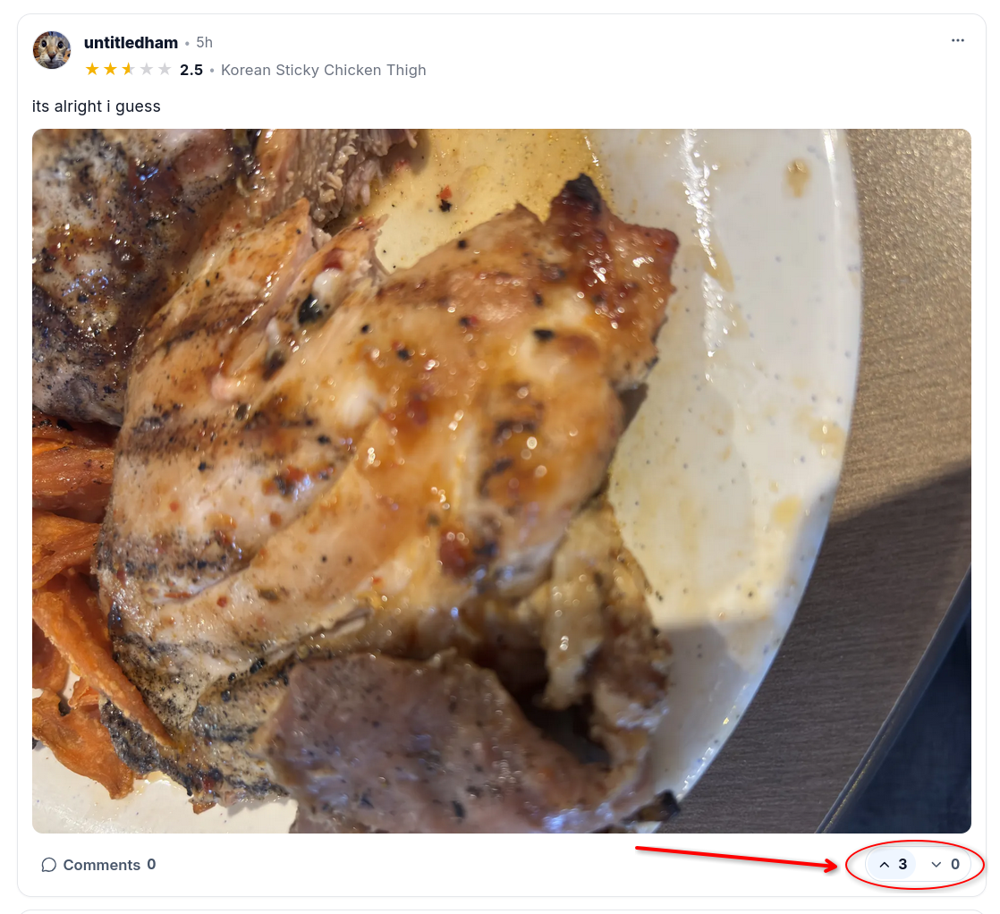
You can also comment on other reviews by clicking the comment button and leaving a comment.
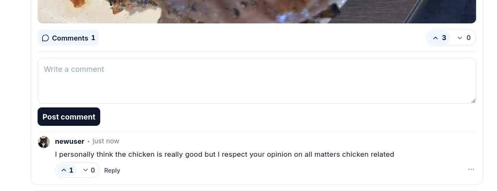

If you just want to see reviews for a specific dining hall, click on the dining hall review page in the sidebar and select the dining hall you want to see reviews for.
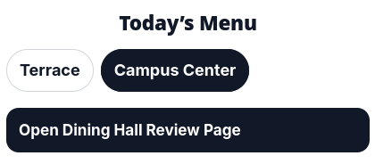

From here you can filter by star rating to find the best or worst items at that dining hall, or just scroll through all the reviews to see what people are saying about the food.

If you want to see your own profile and reviews, go back to the main feed page by clicking the back arrow.
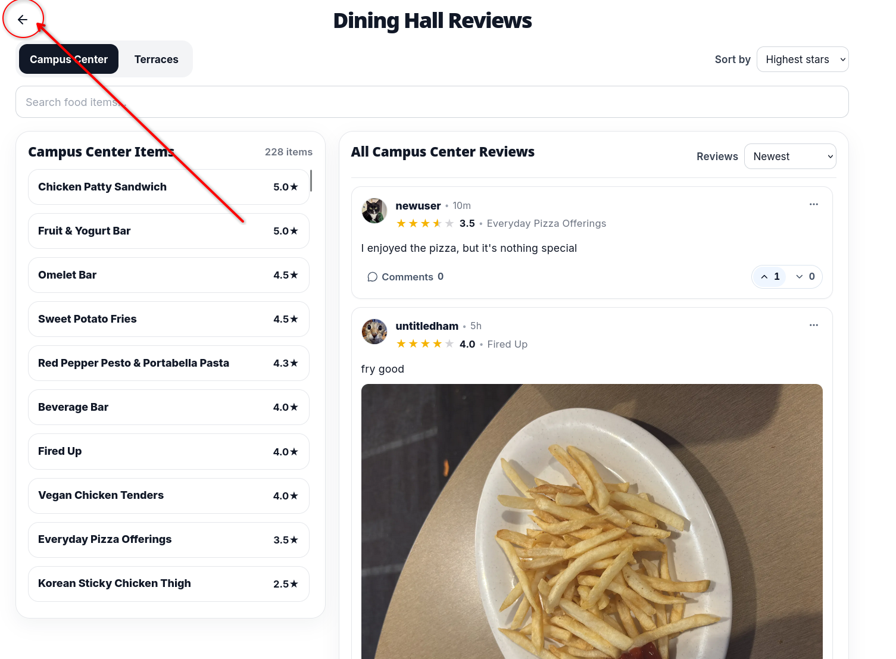
Now click on your profile picture in the top right and click "Profile" to go to your profile page.
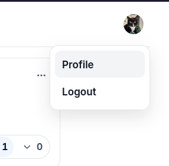

Here you can see all the reviews you have left, as well as your profile information. You can also edit your profile information by clicking on the respective edit buttons.
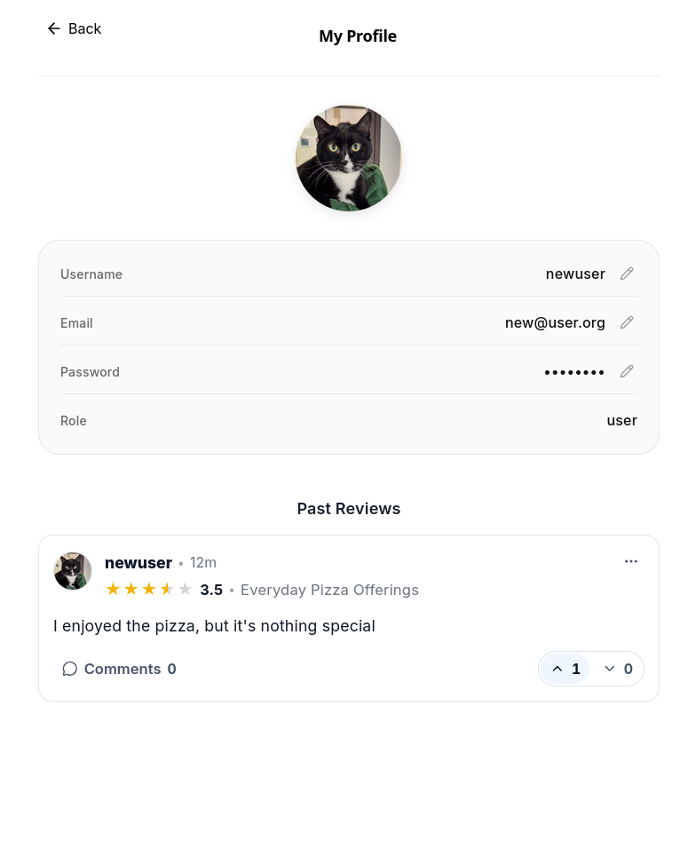

Lets edit your username, click on the edit button next to your username to edit it.
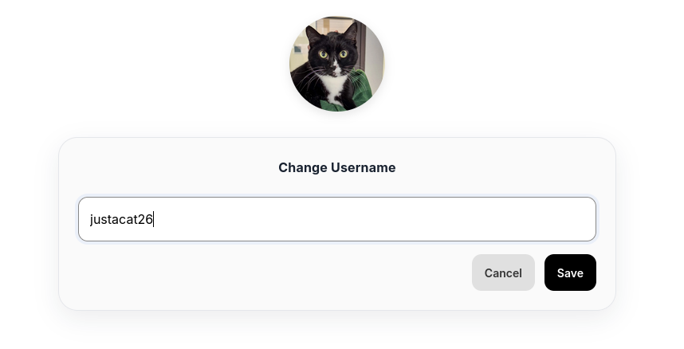
Hit save and your username will be updated!
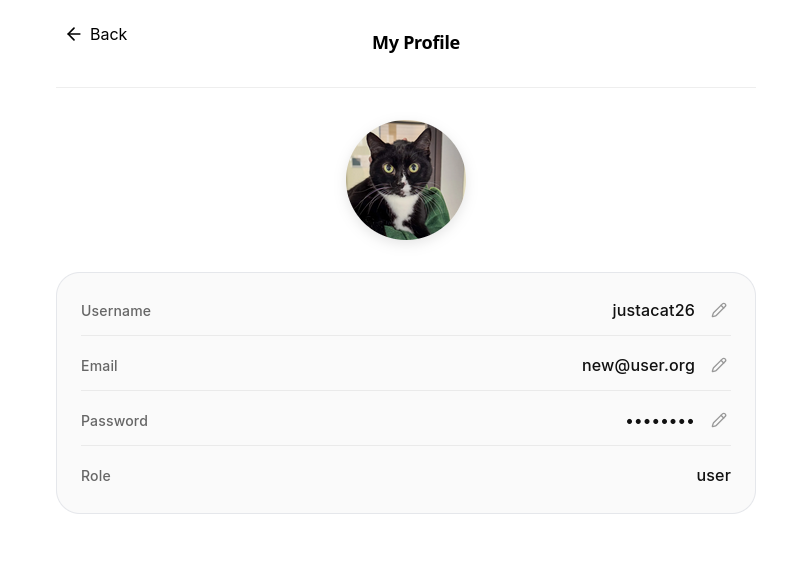

You can do the same for your email, password and profile picture by clicking on the respective edit buttons and following the same process.

Lets view someone else's profile, go back to the main feed  (by hitting the back arrow) and click on someone else's profile picture.
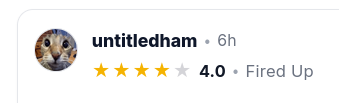

You can see their past reviews and some profile information from this screen.
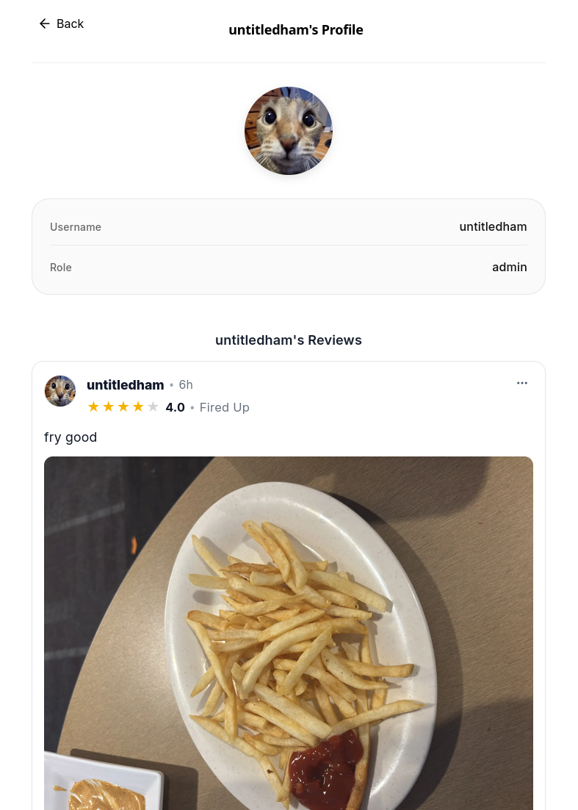

This is not a review, so lets report it by clicking the report button on the review.

Fill in your report and click submit to report the review to the moderators.
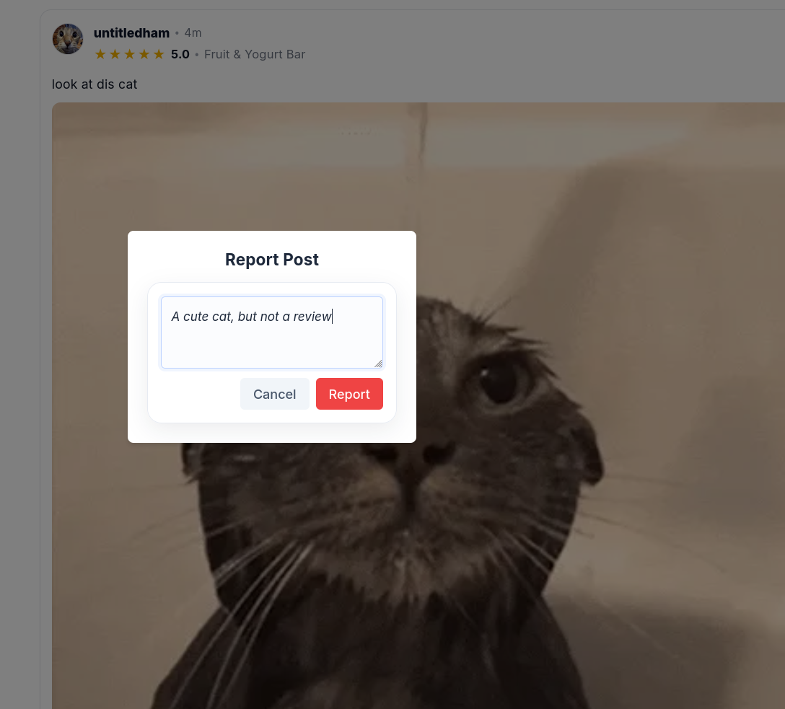

# Admin/Moderator Guide
A admin or moderator user has special permissions that allow them to manage the content on the website. You can log in as the default admin user with the following credentials:
- Username: root 
- Password: root

Note: It is highly recommended to change the default admin password after logging in for the first time.

Also these credentials were changed for the hosted version and only apply to local installations.

Lets look at the reports that have been left by users.
Click on your pfp in the top right and click on "Reported Posts" to access the reported posts page. This page is only accessible to admins and moderators.
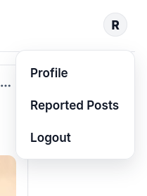

From here you can see all reported posts and the reasons underneath them.
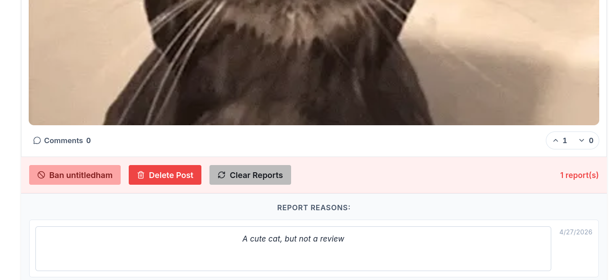
Click on delete post to delete the review, clear reports to clear the reports to remove all reports on the review, or ban user to ban the user who left the review (this will also delete all their reviews and comments).

From the feed page you can also click the 3 dots and remove any review or comment without having to go to the reported posts page.

Moderators can do the above actions, but they cannot set the role of users, only admins can do that. To set the role of a user, go to their profile and use the role dropdown to set their role to either user, moderator or admin.
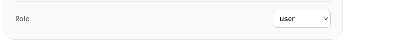
