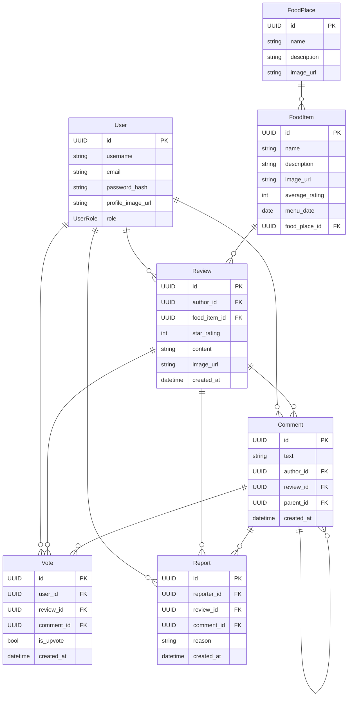

# **IC Eats: A review service for on campus dining**

A web app where you can review food from the dining halls. When you visit the website you can see a feed with all the recent/popular reviews and the current/upcoming menu. You can also leave a new review. When leaving a review you select the dining hall, the date, what meal it is for, and then select the food item from a list of what's currently on the menu. A review includes a picture of the food, a written description, and a star-rating on several criteria. You can leave a comment on a review, vote if it's good or not, and report it. Each user has a profile page showing all the reviews they have made. In addition, each dining hall has its own page where you can see overall statistics, the predicted quality of food based on past statistics, the current menu, and reviews sorted by new/votes/rating. You can also visit a page for each food item that shows stats, reviews, and when it will next appear in the menu. Some accounts are granted moderator permission, they can then view reported posts, delete any post, and ban users.

[Also view on mermaid.live](https://mermaid.live/edit#pako:eNptVF1v2jAU_SuWpUpMgg4oHyEPk7Z23R6o1lFtD4MpcvElWEts5Dh0rOK_79qOWQx7SXzux_H1vUf3la4VB5rSXLPdlswXK0mIepGgO8sv9vfzjbWUineWDxipmVGNra5s0LcqxKyk_Vb1s6d6OlQGSm8kpFC5kBl-VW06y7lFb-cO-WRC9gJesp1WG1FAZ_kdEXn0KIrYAPDGfY_HyMeFFDLPtqwompA7ZyGf0RIid6oymQab0Fk-IiALByL_WpUlSNME3HoUIrAHcGJYIDhj4FAARliizvLOAYK9JJbr7LXAxdoIJavTi50FOPlas0KYA1Ebcq_U6Z0adkqbhnvhQMRbAdPrbbZRdmBPDhAmObkXhQEdUbkS8C3YoNBQ9JLHgq3B5bA9jjsH4mNsmk-8uiIohTaJqwO4Kys8ZdEYXXnVWW-YPMT9eS8P0Tuemcy8wD4wSYLITvc7aXqUiz1kTp-f8GQrwy6KPeomh5ADkvuDpSS93rtIj5GjLUNy6bHyu7S2hBc5W1qL7C0FXcY32oscLUn9r9qTjOJb_mklsrc0cknmh-27hV1tOaIht91hVm3b2Zw9n9srzh2Gdm4vfUmBxbLSLi1Bl0xw3FKvbtFQs4USVjTFI2f614qu5BHjWG3U00GuaWp0DV2qVZ1vabphRYWo3nFs-51guJ_KELJj8odSJ5hre02TjaoBfatqaWg6c6E0faW_adob9kfX_WQwTaaD_uxmOu7SA00Hyex6htbRsJ_MkhGaj136x5EPrvvjyfBmNJkl4-k4GU5GoZyPXOBCDVeCQw9-I7vFfPwLMbvmvg)

[Daily Standup Log](https://docs.google.com/document/d/1Bd0j40ErMJcD9kVfZHUjiKydrN5h3AueoKfGCXfYuHg/edit?usp=sharing)

## Team Roles:
- **Abe Manfra** (Scrum Master/Developer)
- **Finn Witherup** (Project Owner/Developer)
- **Atticus Sandmann** (Developer)
- **Harrison Spangler** (Developer)

## Scrum Backlog:
*Open issues are in progress, closed issues are completed. Issues are tagged with the relevant sprint and/or feature.*
- [**Sprint 1**](https://github.com/VenkatCSClasses/project-2-group-2/milestone/1)
- [**Sprint 1 Review**](https://docs.google.com/document/d/1z2bGQjv06aU-17aqmoSdHR2nd6OT3dNAeKe7ZxNtBM8/edit?usp=sharing)
- [**Sprint 2**](https://github.com/VenkatCSClasses/project-2-group-2/milestone/2)
